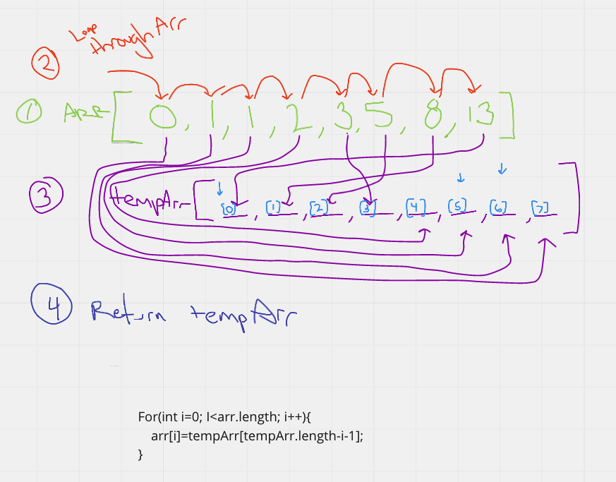
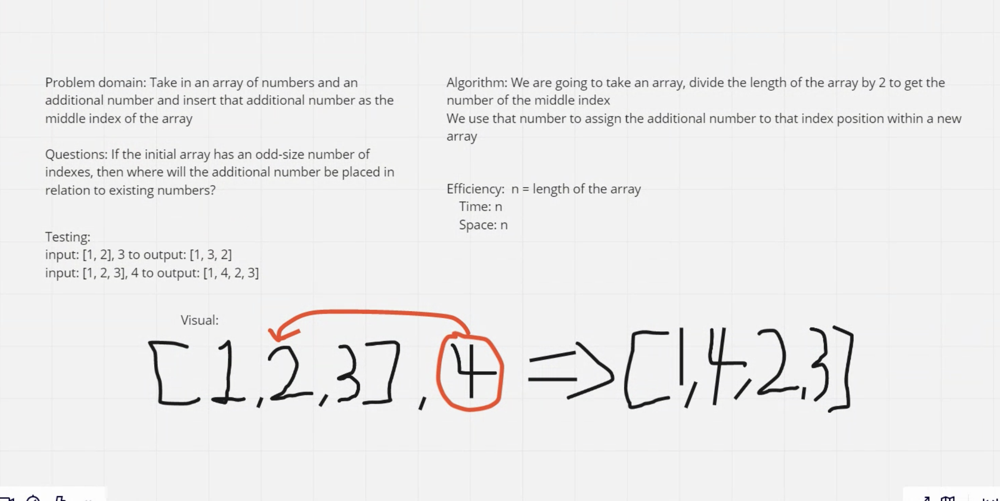

# Challenge 1 Reverse an Array
- Take an array and reverse the data inside the array and return the new array in the reversed order

## Challenge
- Take an array and reverse the data inside the array and return the new array in the reversed order

## Approach & Efficiency
- Started with a whiteboard, figured out how the process will work, and then tackled the actual code. 

## Solution

## collaboration 
Barret Nance, Victor Sullivan, and Andy Agulue 

# Challenge 2 Insert Shift Array
- Take an Array, and an additional number, and return a new Array with all the same numbers as the initial array, but with the additional number as the middle index. 

## Challenge
- Take an Array, and an additional number, and return a new Array with all the same numbers as the initial array, but with the additional number as the middle index. 

## Approach & Efficiency
- Started with a whiteboard, figured out how the process will work, and then tackled the actual code. 

## Solution

## collaboration 
Barret Nance, Leaundrea Mckinney 
  