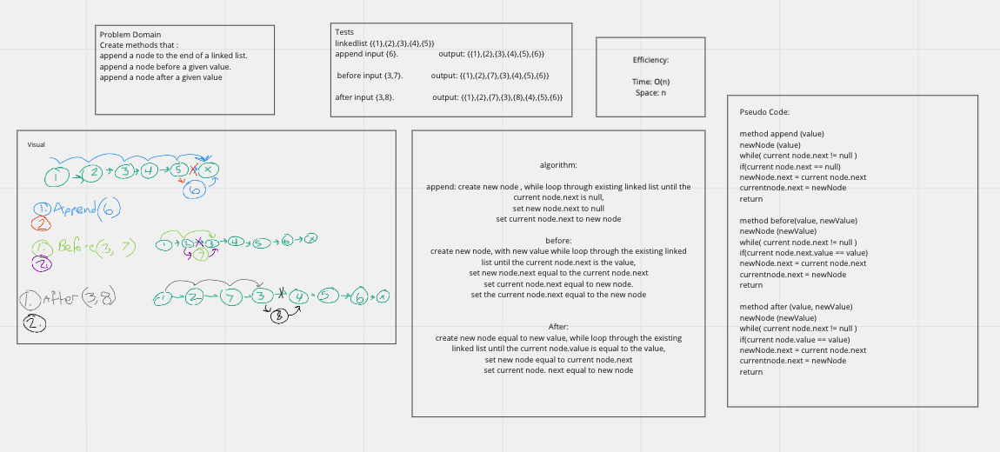

# Single Linked List
A singly linked list is a linked list that is linked from one node to another, from the head, to the next node, to the next node, and so on until reaching the tail node. 

## Challenge 
### Challenge 1
This code challenge was about building a linked list using JAVA. Creating a Node class, and a linked list class
and building a few methods to include : insert, includes, and toString.
### Challenge 2
This code challenge was about adding to the previously linkedlist class and adding three more methods. An append method, 
an insertBefore method, and an insertAfter method. 
## Approach and Efficiency
I built this app based on the instruction in the lab. First built the node class, then the linked list class
and then built the methods. 
### big O 
This linked list takes O(1) time to insert a new node, because it always adds it to the beginning (head) of the list. 
The includes method takes O(n) time to find if a value is present in the list. 
The toString method takes O(n) time as well to stringify the list. 

## API

- the insert method inserts a new node into the linked list
- the includes method returns a boolean of whether or not the linked list includes the value passed in.
- the toString method turns the linked list into a string. 
- the append method inserts a new node at the end of the list
- the insertBefore method takes an existing value and inserts a new node before the given value
- the insertAfter method takes an existing value and inserts a new node after the given value

## solution 

