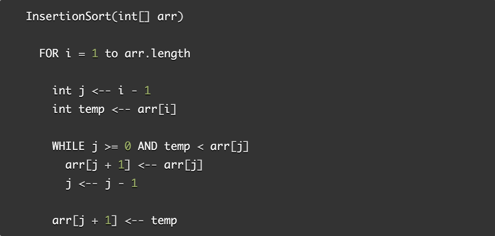
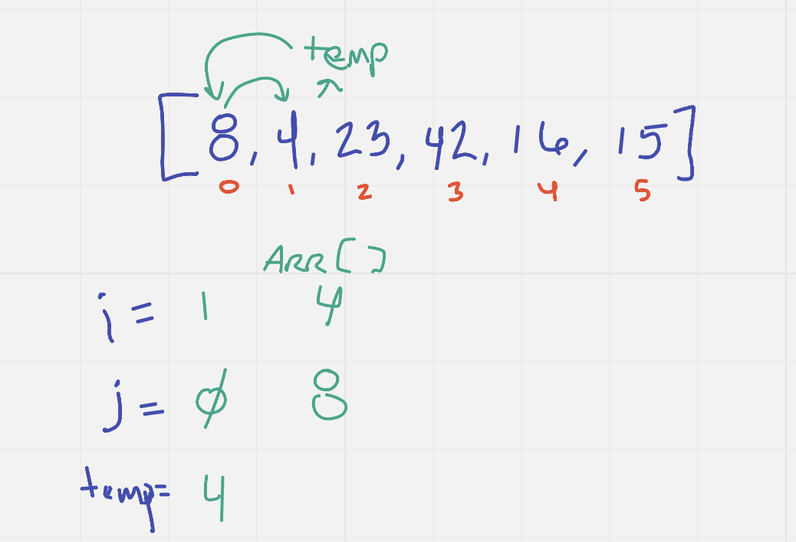
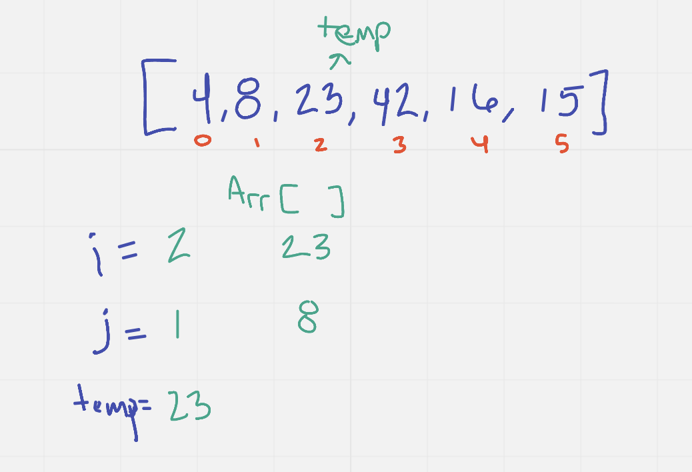
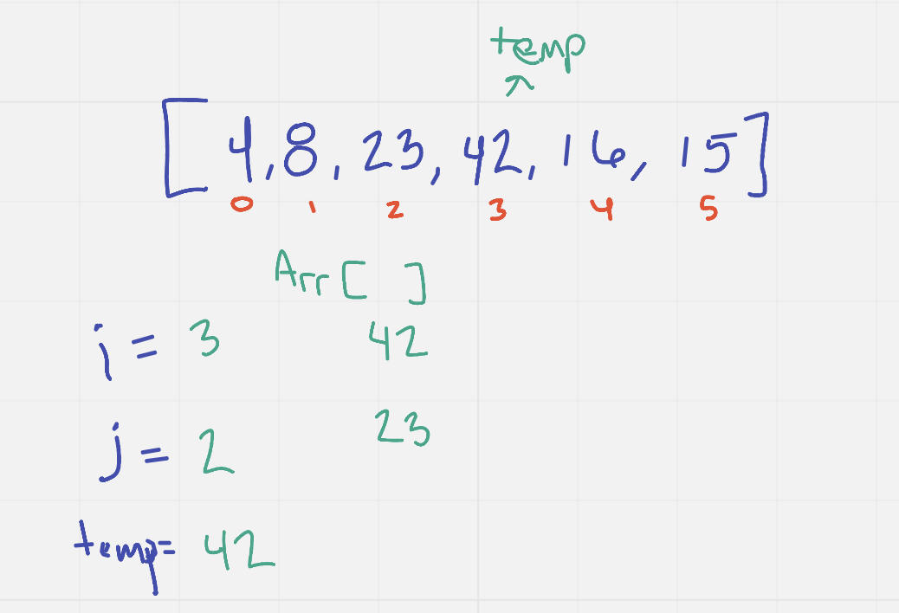
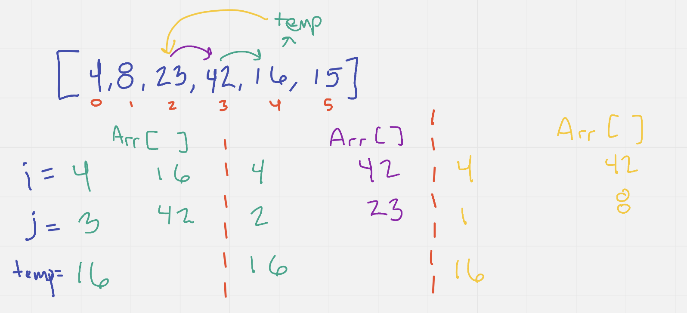
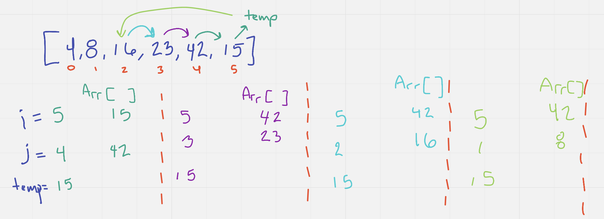

# Insertion Sort Array 

In this article I am going to explain how the Insertion Sort method
for sorting an array works. For this article, I am going to be using 
the sample array as follows: [8,4,23,42,16,15]. 

The Insertion Sort method/function should return the sample array sorted
from smallest to largest as such: [p4,8,15,16,23,42].
The entire method is completed within one FOR loop as follows: 

In the first step, we set an integer variable "i" to the integer 1. Then we set an integer 
variable "j" to be the value of "i" - 1, which in this case is 0.  Then we set a temporary 
variable "temp" to the value of the array at index "i". In this case it is 4. 
Now, the method enters into a WHILE loop, which only runs as long as "j" is less than or equal to
0 (which it is), AND "temp" is less than the value of the array at index "j" which in this 
case is 8. So for this first step both of those criteria are met, so the method WILL run the WHILE
loop which sets the value of the array at index "j + 1" to the value of the array at index "j". So 
in this case, that means that the 4 is now replaced with the 8. Then the WHILE loop continues 
by decrementing "j" which makes it -1 and breaks from the loop, because -1 is less than 0. 
Next, the method sets the value of the array at index "j + 1" to the value of "temp" in this 
case, that is 4. 

In the second step, "i" is set to 2; "j" is set to 1; "temp" is set to 23. Then because
"temp" is not less than the array at index "j" or 8, the while loop is skipped, 
and nothing changes about the array. 

In the third step, "i" is set to 3, "j" is set to 2; "temp" is 42. The WHILE loop is skipped again
because "temp" is not less than the array at index "j" or 23; And nothing changes about the array. 

In step four, "i" is set to 4, "j" to 3, and "temp" to 16. This time, the WHILE loop will not 
be skipped because "temp" IS less than the array at index "j" or 42. So the array at index "i" 
is then replaced with 42, "j" is then set to "j-1" or 2, and the comparison between "temp" and 
the array at index "j" or 23 is run. "temp" is lower, so the value of index 3 is set to 23, "j" is 
set to 1. "temp" is then compared to 8, which "temp" is NOT less than 8 so, the array at index 2 is set 
to the "temp" value of 16. 

Step five is a very similar repeat of step four, with the "temp" value being set to 15
then compared to every number previous to it in the array. If the "temp" is smaller than the previous number
that number moves to the right one space in the array. 

The end result of this method/function is a sorted array with a time efficiency of O(n^2) since the worst case 
scenario is that each number will have to be compared to every other number in the array. 
The Space efficiency is O(1) because the array does not take any more space at the end of the method. 

 
