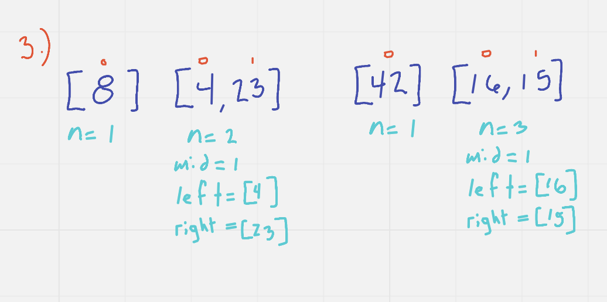

# Merge Sort Array
In this article I am going to explain how the "merge sort" method for sorting the 
values of an array of integers works. Below you can see the pseudocode that I will 
be working with.

For this article, I am going to be using the example array: [8,4,23,42,16,15].

This method relies on a recursive method to complete the sorting which I will 
explain down below. 

As you can see, in step 1, I set a variable "n" to the length of the array, and 
then set another variable "mid" to n /2. Now that I have the middle of the array
defined, I split the original array into a left half and a right half. I used a FOR
loop to iterate through the first half of the array adding each value to "leftArr", and 
another FOR loop to iterate through the second half of the original array adding each 
value to the "rightArr". 

Step 2 is showing the recursive nature of original method, splitting the previously defined 
"leftArr" into its own left and right arrays; and also doing the same for the "rightArr". 

Step 3 shows that the process continues as long as "n" is greater than 1. If the array length is 
1, then it has reached its base case. 

Step 4 is showing what happens once all the numbers have been split into their own length of 1 
arrays. In this case, the last two numbers to be split on the original left side of the array
are the 4 and 23. Compared to each other and then combined together in a new sorted array. 
Then compared to the 8, you can see that the method takes the 4, then takes the 8, and then 
since there was only 1 number in the array that contained the 8, the remainder of the values in
array containing the 23 are added to the new array; leaving us with a sorted array for the left side 
of the original array. The same process is then applied to the right side of the original array, and then 
applied to the left AND right side of the original array resulting in a sorted array from smallest 
to largest. 
