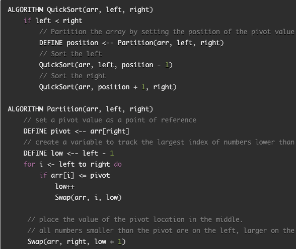
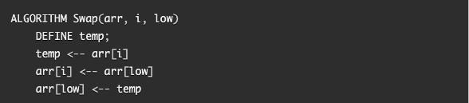
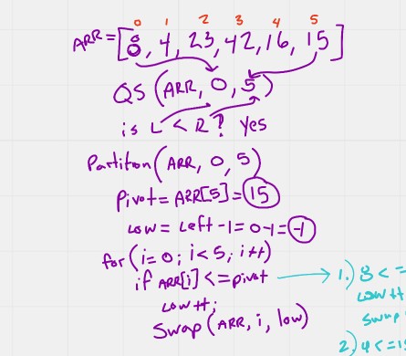
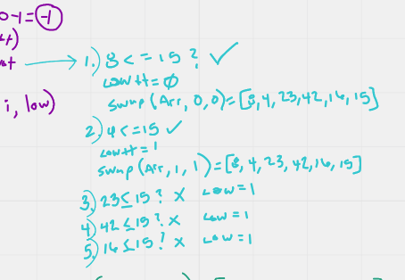
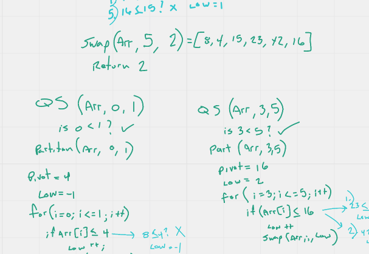
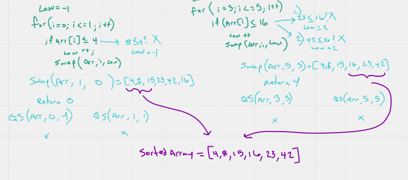

# Quick-Sort Array Method

In this article I am going to describe how the quick-sort method works for sorting
arrays. 
This is the pseudocode I am going to be working with:

There are two supplementary methods inside the QuickSort method: 
1. A Partition method which uses the value of the last index in the array, and places it in the right location
within the array, so that all the values that are smaller than it are on its left, and 
all the numbers that are larger than it are on it's right; then returns its index position.
2. A swap method, that swaps two values within the array.

In this article, I am going to be using the sample array: [8,4,23,42,16,15].

As you can see in step one, we call the QuickSort method, which compares the left most index, to the right most index
and determines if the left is smaller than the right. If that is true, then the Partition method is called on the array. 
The partition method in this case sets the pivot value to be the array at index 5 or "15". It also sets the "low" 
variable to be left -1 or "-1". Then a FOR loop is entered for the values in the array from the left index to the right
index, and in this case, "0" through "5". During the FOR loop if the array at index "i" is less than or equal to the 
pivot value or "15" in this case, the "low" variable is incremented by 1, and the swap method is called on the array
for index "i" and "low". 

In step two, you can see that the first index that is called is the value of "8" which is lower than 15, so the swap method
is called and the "8" is swapped with its self. No change to the array. but the "low" value is now "0". 
Then the "4" is compared to the "15" and again the array does not change at all, but the low value is now "1". 
Then the 23 is compared to the "15" which it is not smaller than, so the loop continues, but leaves the "low" value 
set to "1". 
The same thing happens to all the remaining numbers in the array, which are all greater in value than the "15".
Once the for loop ends, we are left with the array exactly the same as it was when it entered the method, but the "low" 
value is now set to the index of the last number in the array that was smaller than the pivot value. 

The Swap method is then called on the array, but this time it is for the pivot index, which is the value of "15" and 
the "low" variable + 1,  which is "2". Now the array changes to [8,4,15,23,42,16], and the partition method then returns 
the index of "2" knowing that the value at that position is now in its sorted place in the array. All the numbers that 
are smaller than it are on its left, and the numbers that are larger than it are on its right. 

Now the QuickSort Method is called on all the numbers to either side of the "15" using the same logic as before.

Once each side has completed the Partition method and swap methods, we are left with a completely sorted array. 
[4,8,15,16,23,42].
The time efficiency for this method is O(n log n) because there might be an uneven split on either side of the first 
partition, depending on how the array is sorted initially. 
The space efficiency is O(1) because the array is swapped, and there is never any more values added or removed. 

