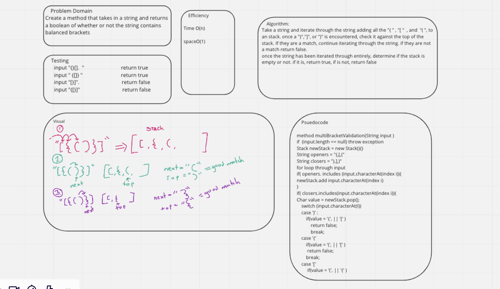
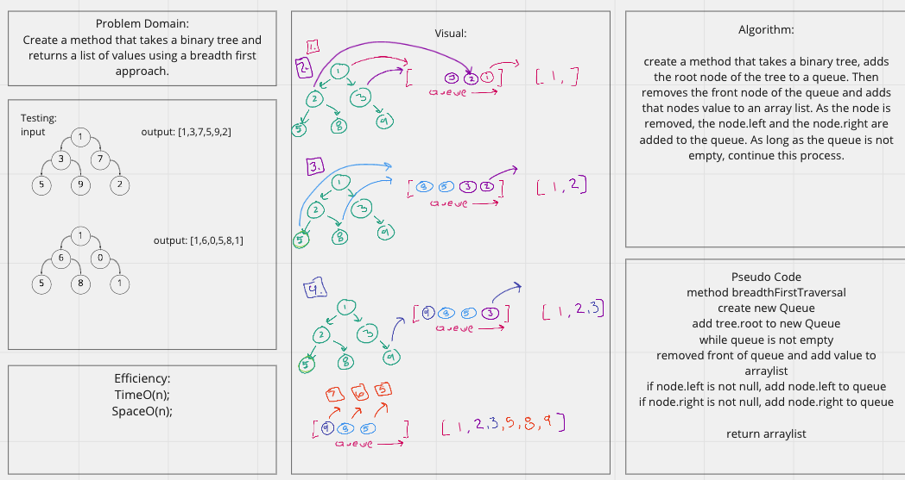

# Utilities
Code challenge 12 

Create an animal class and add animals of either class dog, or cat to the queue using first in first out approach. 
If the animal is not a dog or a cat, throw an exception. Be able to dequeue the dog or the cat that has been in the animal
shelter the longest. 

Code Challenge 13 

Create a method that takes in a string, and returns a boolean if the string contains balanced brackets or not. 

Code Challenge 14 

Create a Tree class with traversals called preOrder, inOrder, and postOrder that return an array of values ordered appropriately. 

Code Challenge 16 
Create a method called findMaximumValue that takes finds the maximum value of nodes in a binary tree. 

Code Challenge 17
Create a method that uses the breadth first approach to finding all the values in a binary tree. 

## Approach 
code challenge 12
create an enQueue method that takes in an animal and places it in the 
cue that corresponds with its type (dog or Cat); 
Create a deQueue method that takes a parameter either dog or cat, and 
returns the animal of said type that has been in the animal shelter the longest

code Challenge 13  

Iterate through the string. If the character is a opening bracket, push it into a stack. if the character is a closing bracket
determine if  the top of the stack is the opening bracket of the same type. if it is, continue, if it is not, return false. 
once the entire string has been looped through, determine if the stack is empty. If it is, return true, if not return false. 

Code Challenge 14

The tree class uses Nodes as a linked list tree to order nodes with a value, a left and a right node. By assigning each new value a 
specific place with in the tree, the traversal methods are created using a stack, to determine which order the values gets added to the arraylist.

Code Challenge 16

The method findMaximumValue is built into the tree class, and takes the tree, uses a recursive approach to set the value of the root node to the
maximum value, then checks to see if a node.left exists and if so checks to see if the value of the node is greater than the existing max value
if it does, the value is replaced, and then calls the method again on the next .left node. if the left node, does not exist it looks to see if there 
is a node.right. if there is, it calles the same function on the .right node, and so on a so forth throughout the entire tree. The method then 
returns the max value as an integer. 

Code Challenge 17
The method breadthFirstTraversal is built using a queue to temporarily hold the nodes of the binary tree. First, the tree root is added to the 
queue, then removed from the queue and added to an array list. as a value is removed from the queue, its left and right nodes are added to 
the queue respectively if they exist. As long as the queue has values, the while loop will continue to loop and add values from the queue to
the array list. 
## Big O 
Challenge 12
Time: O(1);

space: O(1);

challenge 13

Time: O(n);
Space: O(1);

Challenge 14:
Time: O(log(n))
Space O(n);

Challenge 16
Time: O(n);
Space: O(1);

Challenge 17 
Time: O(n);
Space: O(n);
## Whiteboard

