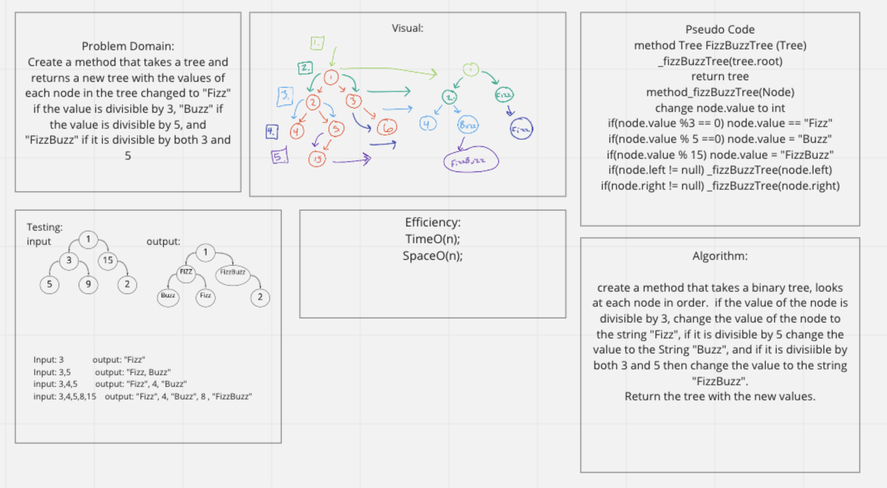
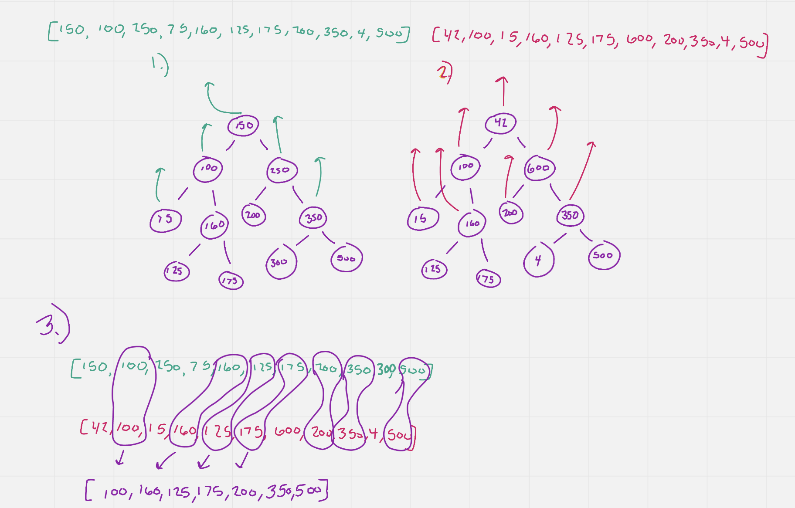
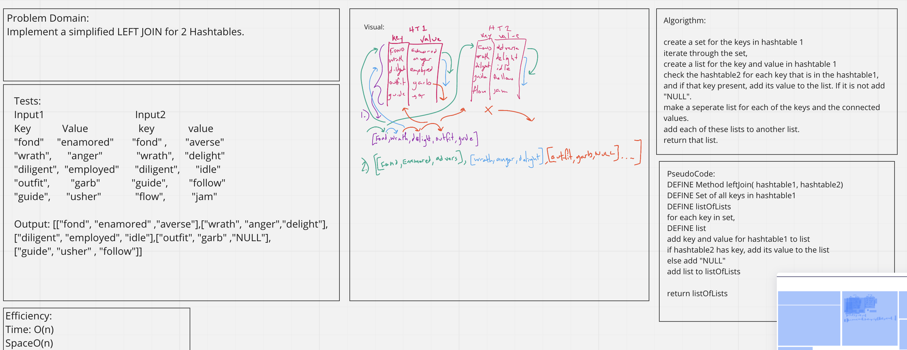

# Utilities
Code challenge 12 

Create an animal class and add animals of either class dog, or cat to the queue using first in first out approach. 
If the animal is not a dog or a cat, throw an exception. Be able to dequeue the dog or the cat that has been in the animal
shelter the longest. 

Code Challenge 13 

Create a method that takes in a string, and returns a boolean if the string contains balanced brackets or not. 

Code Challenge 14 

Create a Tree class with traversals called preOrder, inOrder, and postOrder that return an array of values ordered appropriately. 

Code Challenge 16 
Create a method called findMaximumValue that takes finds the maximum value of nodes in a binary tree. 

Code Challenge 17
Create a method that uses the breadth first approach to finding all the values in a binary tree. 

Code Challenge 18
Code Challenge 18
Create a method FizzBuzzTree that takes in a tree and returns a new tree with the values of each node changed to "fizz" if it is divisible by 3,
"Buzz" if it is divisible by 5, and "FizzBuzz" if it is divisible by 3 and 5. the value of each node will stay the same if it doesnt
fit either of those cases.

CodeChallenge 30
HashTables-
Create a hashtable with add, contains, get, and hash methods. 

CodeChallenge 31
Hashtables - repeated words

Code Challenge 32
HashTables - Tree Intersection

Code Challenge 33
HashTables LeftJoin

Code Challenge 35 
Graphs - create a graph with addVertex, addEdge, getNeighbors, getVertexes, getSize methods. 

Code Challenge 36 
Graphs - breadthFirstTraversal
## Approach 
code challenge 12
create an enQueue method that takes in an animal and places it in the 
cue that corresponds with its type (dog or Cat); 
Create a deQueue method that takes a parameter either dog or cat, and 
returns the animal of said type that has been in the animal shelter the longest

code Challenge 13  

Iterate through the string. If the character is a opening bracket, push it into a stack. if the character is a closing bracket
determine if  the top of the stack is the opening bracket of the same type. if it is, continue, if it is not, return false. 
once the entire string has been looped through, determine if the stack is empty. If it is, return true, if not return false. 

Code Challenge 14

The tree class uses Nodes as a linked list tree to order nodes with a value, a left and a right node. By assigning each new value a 
specific place with in the tree, the traversal methods are created using a stack, to determine which order the values gets added to the arraylist.

Code Challenge 16

The method findMaximumValue is built into the tree class, and takes the tree, uses a recursive approach to set the value of the root node to the
maximum value, then checks to see if a node.left exists and if so checks to see if the value of the node is greater than the existing max value
if it does, the value is replaced, and then calls the method again on the next .left node. if the left node, does not exist it looks to see if there 
is a node.right. if there is, it calles the same function on the .right node, and so on a so forth throughout the entire tree. The method then 
returns the max value as an integer. 

Code Challenge 17
The method breadthFirstTraversal is built using a queue to temporarily hold the nodes of the binary tree. First, the tree root is added to the 
queue, then removed from the queue and added to an array list. as a value is removed from the queue, its left and right nodes are added to 
the queue respectively if they exist. As long as the queue has values, the while loop will continue to loop and add values from the queue to
the array list. 

Code Challenge 18 
The method FizzBuzzTree takes in a tree and returns a new tree with the values of each node changed to "fizz" if it is divisible by 3, 
"Buzz" if it is divisible by 5, and "FizzBuzz" if it is divisible by 3 and 5. the value of each node will stay the same if it doesnt
fit either of those cases. 

Code Challenge 30
The approach for this challenge was to create the class "Hashtable" use a constructor to build the hashtable that creates an array of linkelists. 
The add method takes in a key and a value, and adds that value to the linked list at the key. The contains method takes in a key, and returns a boolean 
of whether or not the hashtable has a value at that key. The contains method takes in a key, and returns the linkedlist at that key. The hash method 
takes a key, changes the key into a string. Then gets the character value of each index in the string. Adds them together and then gets the dirivitive of 
the that number from the size of the hashtable its self. Allowing any string or number or series of characters to be used as the key, which is 
always going to return a number between 0 and the length of the hashtable. 

Code Challenge 31
This challenge used a method that took in a long string, and returned the first word that was repeated in that string. The method split the 
string into an array of individual words. Then used an IF statement to determine if each word was already in the hashtable, if it came across a 
word that was already used as a "key" in the table, it saved that word and continued adding all the unique words to the table. Then it returned the
first word that was repeated.

Code Challenge 32
This challenge is designed to take in two trees and return a list of all the values that are in both trees. The method takes in two trees as arguments, 
iterates through each of the trees and creates an arraylist for each of them. Then iterates through the first tree's array and adds all the values to
a hashtable using the values in the array as the keys and the number 1 as the value. Then iterates through the second arraylist, comparing each 
value to the keys in the hashtable, and if there is a match, adds that key to another array, and increments the value in the hashtable. 
Once the second arraylist has been comppletely interated through, The method returns the results array.

Code Challenge 33
This challenge was about doing a leftjoin on two hashtables. If the both of the hashtables had the same key, 
then add the key, and both values to a list. If the second table did not have the the key that the first table has
then add NULL to the list. Do not add the key and value if only the second table had the key. 

Code Challenge 35
This challenge was all about graphs. Creating graphs with vertexes and edges. First I constructed a graph class, then 
vertex class and an edge class. The Graph class holds onto a list of vertexes and a list of edges. Each vertex holds
onto a value and a list of edges. Each edge holds on to two vertexes and an optional "weight" between the two. The 
addVertex adds a vertex to the list of vertex in that graph, the addEdge method takes in two vertexes and an optional
weight and holds on to that connection. The getVertexes method return the list of vertexes for that graph, and the 
getNeighbors method takes in a vertex and returns all of the edges that that vertex has. The getSize method returns
the size of the list of vertexes for the given graph. 

Code Challenge 36 
This challenge was about creating a breadth first traversal of the vertexes in a graph. I started with taking in a vertex
creating a new Queue and a new Set. The method takes the given vertex value and adds to the queue, then uses the poll()
method to remove the top of the queue and add that value to the set which is a linkedHashSet that keeps the order of the 
values added to it, and avoids duplicates. Then the method looks at the values of all of the edges for the given vertex
and if the set does not contian them, then adds each one to the queue. While the queue is not empty, this process is 
repeated and then the method returns the set. The set is comprised of all of the values of each vertex that is connected 
with edges in the graph, in order that they are visited. 

## Big O 
Challenge 12
Time: O(1);

space: O(1);

challenge 13

Time: O(n);
Space: O(1);

Challenge 14:
Time: O(log(n))
Space O(n);

Challenge 16
Time: O(n);
Space: O(1);

Challenge 17 
Time: O(n);
Space: O(n);

Challenge 18 
Time: O(n);
Space: O(n);

Challenge 31 
Time: O(1)
Space: O(n)

Challenge 32
Time: O(n);
Space: O(n);

Challenge 33
Time:O(n)
Space: O(n)

Challenge 35
Time: O(n);
Space: O(n);

Challenge 36 
Time: O(N);
Space: O(n);
## Whiteboard

